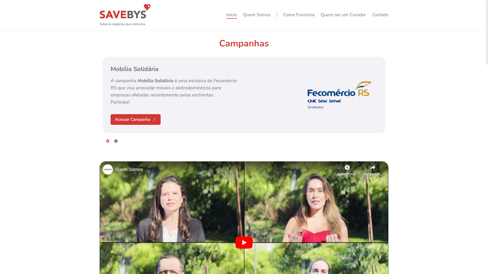

# SAVEBYS - Salve os Negócios que Você Ama



SAVEBYS é uma plataforma de auxílio coletivo voltada para empresas. A iniciativa nasceu como uma resposta às enchentes no Rio Grande do Sul em 2024, buscando ajudar empresas impactadas a se reerguerem por meio de campanhas colaborativas. A plataforma permite que qualquer pessoa participe de campanhas para apoiar negócios locais de diversas maneiras.

## Tecnologias Utilizadas

Este projeto foi desenvolvido utilizando as seguintes tecnologias:

- **[Next.js](https://nextjs.org/)** - Framework React para construção de aplicações web modernas e escaláveis.
- **[Tailwind CSS](https://tailwindcss.com/)** - Framework de CSS utilitário para estilização rápida e responsiva.
- **[TypeScript](https://www.typescriptlang.org/)** - Superset do JavaScript que adiciona tipagem estática.
- **[Zustand](https://github.com/pmndrs/zustand)** - Biblioteca para gerenciamento de estados globais.
- **[TanStack Query](https://tanstack.com/query/latest)** - Gerenciador de cache e sincronização de dados assíncronos no front-end.

## Funcionalidades

- **Campanhas de apoio a empresas**: Criação e gestão de campanhas para auxiliar negócios em dificuldades.
- **Participação colaborativa**: Usuários podem contribuir nas campanhas para ajudar as empresas cadastradas.
- **Integração futura**: Planejamos implementar mais funcionalidades para melhorar a experiência de usuários/empresas e automatizar a criação e monitoramento de campanhas.

## Como Rodar o Projeto

1. Tenha o Node instalado em sua máquina (Versão recomendada: 20.11.1):

   ```
   https://nodejs.org/pt/blog/release/v20.11.1
   ```

2. Clone este repositório:

   ```bash
   git clone https://github.com/ycarlosedu/savebys.git
   ```

3. Instale as dependências:

   ```bash
   cd savebys
   npm install
   ```

4. Inicie o servidor de desenvolvimento:

   ```bash
   npm run dev
   ```

5. Abra o navegador e acesse:
   ```
   http://localhost:3000
   ```

## Contribuições

Contribuições são bem-vindas! Se você deseja reportar um bug ou sugerir novas funcionalidades, sinta-se à vontade para abrir uma issue ou submeter um pull request.

## Licença

Este projeto está sob a licença MIT. Veja o arquivo [LICENSE](./LICENSE) para mais detalhes.
